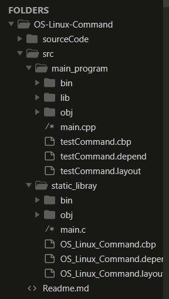

## 操作系统课程设计
+ 实现Windows下，兼容Unix/Linux命令接口
+ OS_Linux_Command.exe 是演示程序
+ 实现了ls,cat,cp,rm,mv,mkdir,rmdir,cd,find等命令

#### 目录结构说明：

- sourceCode 中是源码
- src 中是静态库和演示程序的项目(CodeBlocks项目)
- lib文件夹下是封装好的.a库文件(VS 2019封装的是.lib文件)